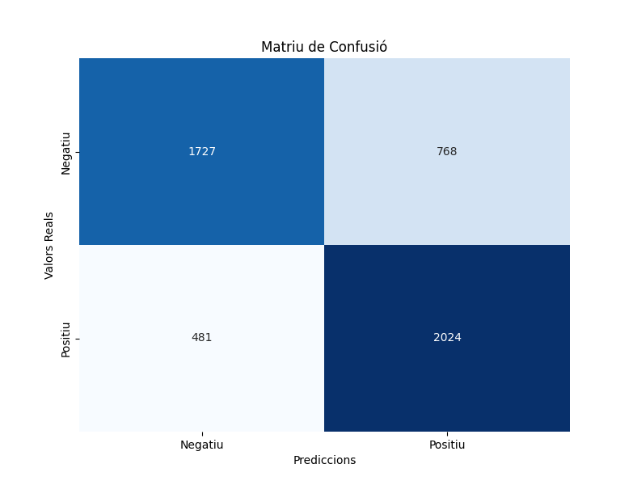
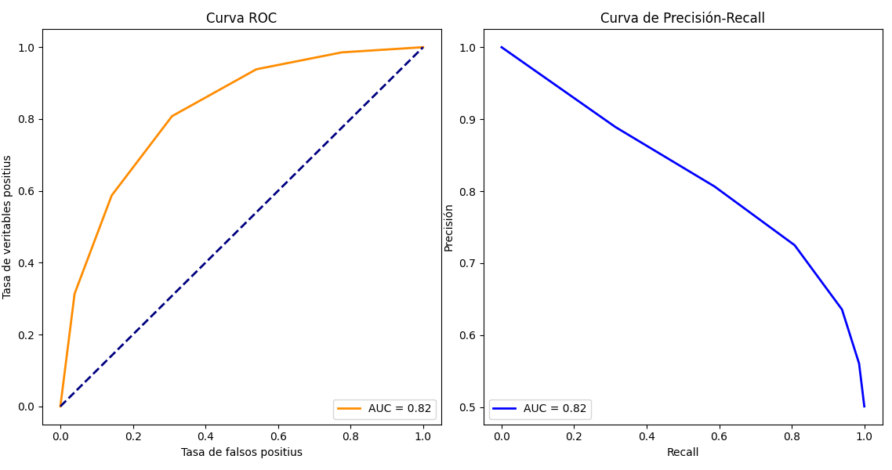
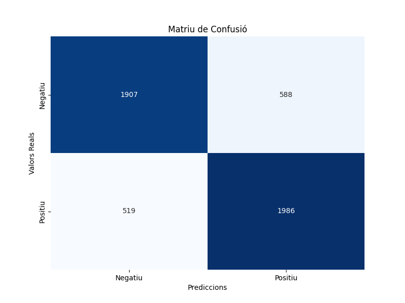
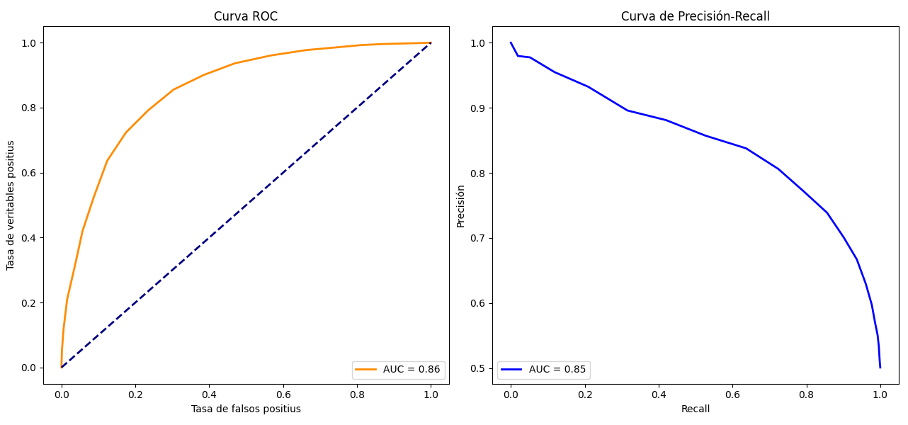
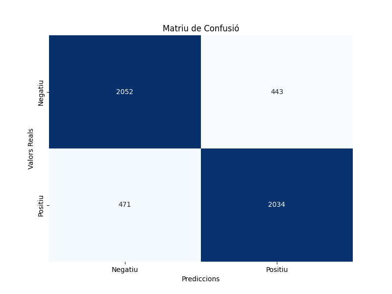
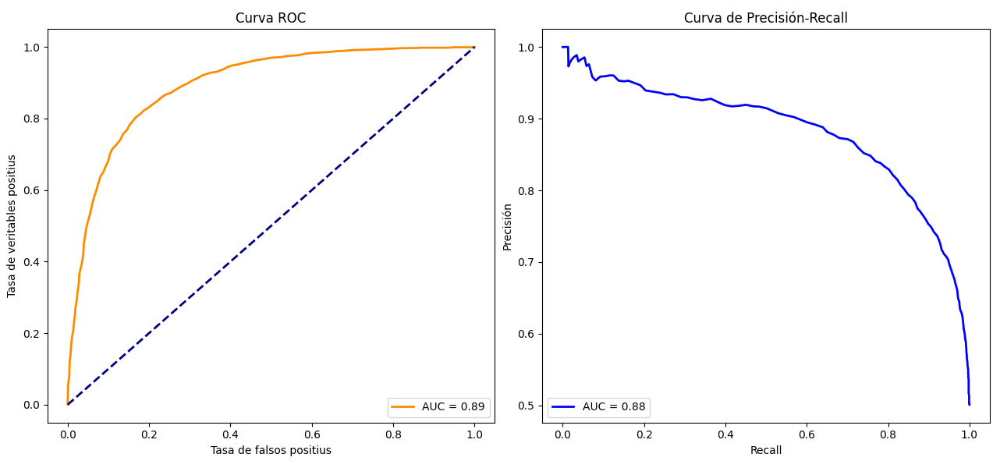

# Sentiment Analysis : Movies

## 1. Models

### 1.1 KNN

Primera execució model KNN, n_neighbors=5 :

temps preocessar 124.6710159778595

Matriu de confusió:
[[1727  768]
 [ 481 2024]]

Accuracy: 0.7502
Precision: 0.7535
Recall: 0.7502
F1 Score: 0.7493
temps entrenament 22.811246871948242

Segona execució model KNN, n_neighbors=10 :
temps preocessar 256.92059874534607

Matriu de confusió:
[[1924  571]
 [ 588 1917]]

Accuracy: 0.7682
Precision: 0.7682
Recall: 0.7682
F1 Score: 0.7682
temps entrenament 48.164021253585815

Tercera execució model KNN, n_neighbors=5, plots inclosos :

temps preocessar 109.44386577606201

Matriu de confusió:
[[1727  768]
 [ 481 2024]]

Accuracy: 0.7502
Precision: 0.7535
Recall: 0.7502

F1 Score: 0.7493
temps entrenament 150.65066742897034

Quarta execució model KNN, n_neighbors=20, plots inclosos :
Temps trigat a processar les dades : 122.23539853096008

Matriu de confusió:
[[1907  588]
 [ 519 1986]]

Accuracy: 0.7786
Precision: 0.7788
Recall: 0.7786

F1 Score: 0.7786
temps entrenament 156.88142585754395

Cinquena execució model KNN, n_neighbors=200 (sqrt(n_mostres)), plots inclosos :
Temps trigat a processar les dades : 145.36676931381226
model utilitzat: KNN

Matriu de confusió:
[[2052  443]
 [ 471 2034]]

Accuracy: 0.8172
Precision: 0.8172
Recall: 0.8172

F1 Score: 0.8172
temps entrenament 817.1725895404816

Testing:
k=1: Accuracy mitjana=0.7045
k=2: Accuracy mitjana=0.7032
k=3: Accuracy mitjana=0.7259
k=4: Accuracy mitjana=0.7291
k=5: Accuracy mitjana=0.7346
k=6: Accuracy mitjana=0.7405
k=7: Accuracy mitjana=0.7447
k=8: Accuracy mitjana=0.7485
k=9: Accuracy mitjana=0.7514
k=10: Accuracy mitjana=0.7539
k=11: Accuracy mitjana=0.7554
k=12: Accuracy mitjana=0.7592
k=13: Accuracy mitjana=0.7592
k=14: Accuracy mitjana=0.7634
k=15: Accuracy mitjana=0.7622
k=16: Accuracy mitjana=0.7634
k=17: Accuracy mitjana=0.7642
k=18: Accuracy mitjana=0.7675
k=19: Accuracy mitjana=0.7672
k=20: Accuracy mitjana=0.7706
k=21: Accuracy mitjana=0.7709
k=22: Accuracy mitjana=0.7718
k=23: Accuracy mitjana=0.7721
k=24: Accuracy mitjana=0.7747
k=25: Accuracy mitjana=0.7742
k=26: Accuracy mitjana=0.7753
k=27: Accuracy mitjana=0.7758
k=28: Accuracy mitjana=0.7776
k=29: Accuracy mitjana=0.7773
k=30: Accuracy mitjana=0.7792
k=31: Accuracy mitjana=0.7802
k=32: Accuracy mitjana=0.7801
k=33: Accuracy mitjana=0.7801
k=34: Accuracy mitjana=0.7802
k=35: Accuracy mitjana=0.7821
k=36: Accuracy mitjana=0.7816
k=37: Accuracy mitjana=0.7823
k=38: Accuracy mitjana=0.7829
k=39: Accuracy mitjana=0.7831
k=40: Accuracy mitjana=0.7850
k=41: Accuracy mitjana=0.7849
k=42: Accuracy mitjana=0.7861
k=43: Accuracy mitjana=0.7854
k=44: Accuracy mitjana=0.7863
k=45: Accuracy mitjana=0.7867
k=46: Accuracy mitjana=0.7863
k=47: Accuracy mitjana=0.7877
k=48: Accuracy mitjana=0.7884
k=49: Accuracy mitjana=0.7893
k=50: Accuracy mitjana=0.7881
k=51: Accuracy mitjana=0.7892
k=52: Accuracy mitjana=0.7891
k=53: Accuracy mitjana=0.7899
k=54: Accuracy mitjana=0.7894
k=55: Accuracy mitjana=0.7913
k=56: Accuracy mitjana=0.7901
k=57: Accuracy mitjana=0.7909
k=58: Accuracy mitjana=0.7910
k=59: Accuracy mitjana=0.7923
k=60: Accuracy mitjana=0.7915
k=61: Accuracy mitjana=0.7921
k=62: Accuracy mitjana=0.7926
k=63: Accuracy mitjana=0.7932
k=64: Accuracy mitjana=0.7925
k=65: Accuracy mitjana=0.7935
k=66: Accuracy mitjana=0.7925
k=67: Accuracy mitjana=0.7931
k=68: Accuracy mitjana=0.7934
k=69: Accuracy mitjana=0.7939
k=70: Accuracy mitjana=0.7939
k=71: Accuracy mitjana=0.7934
k=72: Accuracy mitjana=0.7943
k=73: Accuracy mitjana=0.7945
k=74: Accuracy mitjana=0.7938
k=75: Accuracy mitjana=0.7949
k=76: Accuracy mitjana=0.7952
k=77: Accuracy mitjana=0.7957
k=78: Accuracy mitjana=0.7958
k=79: Accuracy mitjana=0.7970
k=80: Accuracy mitjana=0.7965
k=81: Accuracy mitjana=0.7973
k=82: Accuracy mitjana=0.7961
k=83: Accuracy mitjana=0.7966
k=84: Accuracy mitjana=0.7964
k=85: Accuracy mitjana=0.7971
k=86: Accuracy mitjana=0.7964
k=87: Accuracy mitjana=0.7972
k=88: Accuracy mitjana=0.7964
k=89: Accuracy mitjana=0.7982
k=90: Accuracy mitjana=0.7966
k=91: Accuracy mitjana=0.7980
k=92: Accuracy mitjana=0.7973
k=93: Accuracy mitjana=0.7979
k=94: Accuracy mitjana=0.7976
k=95: Accuracy mitjana=0.7978
k=96: Accuracy mitjana=0.7973
k=97: Accuracy mitjana=0.7983
k=98: Accuracy mitjana=0.7980
k=99: Accuracy mitjana=0.7982
k=100: Accuracy mitjana=0.7981
k=101: Accuracy mitjana=0.7992
k=102: Accuracy mitjana=0.7989
k=103: Accuracy mitjana=0.7993
k=104: Accuracy mitjana=0.7996
k=105: Accuracy mitjana=0.8007
k=106: Accuracy mitjana=0.7997
k=107: Accuracy mitjana=0.8015
k=108: Accuracy mitjana=0.8004
k=109: Accuracy mitjana=0.8014
k=110: Accuracy mitjana=0.8013
k=111: Accuracy mitjana=0.8017
k=112: Accuracy mitjana=0.8014
k=113: Accuracy mitjana=0.8020
k=114: Accuracy mitjana=0.8014
k=115: Accuracy mitjana=0.8020
k=116: Accuracy mitjana=0.8019
k=117: Accuracy mitjana=0.8021
k=118: Accuracy mitjana=0.8021
k=119: Accuracy mitjana=0.8026
k=120: Accuracy mitjana=0.8017
k=121: Accuracy mitjana=0.8024 
k=122: Accuracy mitjana=0.8019
k=123: Accuracy mitjana=0.8026
k=124: Accuracy mitjana=0.8025
k=125: Accuracy mitjana=0.8027
k=126: Accuracy mitjana=0.8027
k=127: Accuracy mitjana=0.8021
k=128: Accuracy mitjana=0.8026
k=129: Accuracy mitjana=0.8035
k=130: Accuracy mitjana=0.8034
k=131: Accuracy mitjana=0.8038
k=132: Accuracy mitjana=0.8031
k=133: Accuracy mitjana=0.8038
k=134: Accuracy mitjana=0.8040
k=135: Accuracy mitjana=0.8041
k=136: Accuracy mitjana=0.8039
k=137: Accuracy mitjana=0.8040
k=138: Accuracy mitjana=0.8035
k=139: Accuracy mitjana=0.8037
k=140: Accuracy mitjana=0.8037
k=141: Accuracy mitjana=0.8046
k=142: Accuracy mitjana=0.8038
k=143: Accuracy mitjana=0.8043
k=144: Accuracy mitjana=0.8040
k=145: Accuracy mitjana=0.8044
k=146: Accuracy mitjana=0.8040
k=147: Accuracy mitjana=0.8048
k=148: Accuracy mitjana=0.8043
k=149: Accuracy mitjana=0.8048
k=150: Accuracy mitjana=0.8044
k=151: Accuracy mitjana=0.8045
k=152: Accuracy mitjana=0.8040
k=153: Accuracy mitjana=0.8051
k=154: Accuracy mitjana=0.8044
k=155: Accuracy mitjana=0.8047
k=156: Accuracy mitjana=0.8046
k=157: Accuracy mitjana=0.8058
k=158: Accuracy mitjana=0.8045
k=159: Accuracy mitjana=0.8054
k=160: Accuracy mitjana=0.8047
k=161: Accuracy mitjana=0.8056
k=162: Accuracy mitjana=0.8052
k=163: Accuracy mitjana=0.8060
k=164: Accuracy mitjana=0.8050
k=165: Accuracy mitjana=0.8059
k=166: Accuracy mitjana=0.8055
k=167: Accuracy mitjana=0.8058
k=168: Accuracy mitjana=0.8057
k=169: Accuracy mitjana=0.8058
k=170: Accuracy mitjana=0.8050
k=171: Accuracy mitjana=0.8055
k=172: Accuracy mitjana=0.8044
k=173: Accuracy mitjana=0.8046
k=174: Accuracy mitjana=0.8037
k=175: Accuracy mitjana=0.8046
k=176: Accuracy mitjana=0.8043
k=177: Accuracy mitjana=0.8050
k=178: Accuracy mitjana=0.8045
k=179: Accuracy mitjana=0.8059
k=180: Accuracy mitjana=0.8051
k=181: Accuracy mitjana=0.8057
k=182: Accuracy mitjana=0.8052
k=183: Accuracy mitjana=0.8059
k=184: Accuracy mitjana=0.8054
k=185: Accuracy mitjana=0.8065
k=186: Accuracy mitjana=0.8059
k=187: Accuracy mitjana=0.8066
k=188: Accuracy mitjana=0.8066
k=189: Accuracy mitjana=0.8064
k=190: Accuracy mitjana=0.8073
k=191: Accuracy mitjana=0.8071
k=192: Accuracy mitjana=0.8068
k=193: Accuracy mitjana=0.8074
k=194: Accuracy mitjana=0.8071
k=195: Accuracy mitjana=0.8076
k=196: Accuracy mitjana=0.8072
k=197: Accuracy mitjana=0.8074
k=198: Accuracy mitjana=0.8069
k=199: Accuracy mitjana=0.8075
k=200: Accuracy mitjana=0.8073

Millor k trobat: 195 amb accuracy=0.8076
Entrenant amb el millor k=195...

Matriu de confusió:
[[2040  455]
 [ 453 2052]]

Accuracy: 0.8184
Precision: 0.8184
Recall: 0.8184
F1 Score: 0.8184
temps entrenament 9435.598211288452
### 1.2 LR

### 1.3 NB

### 1.4 RF

### 1.5 SVM

