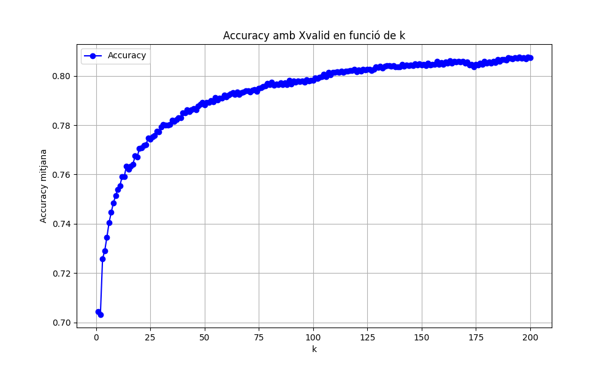
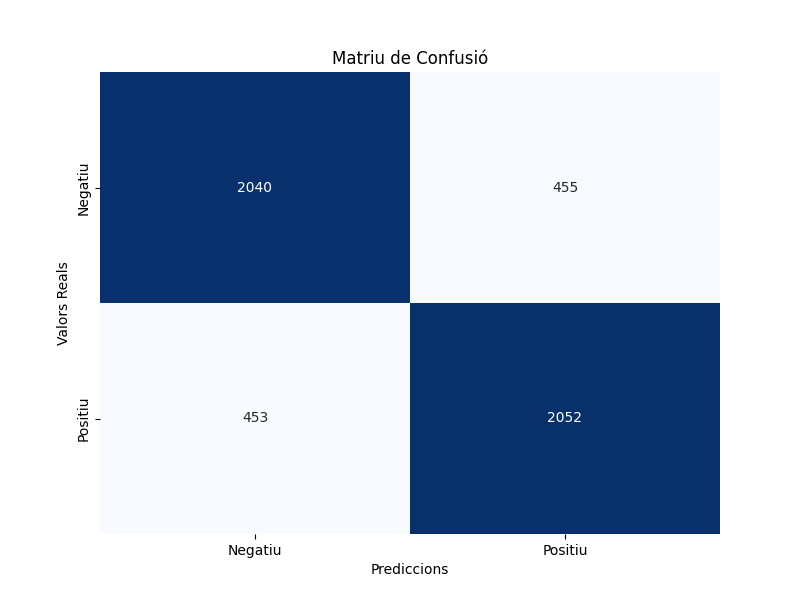

# Sentiment Analysis : Movies

## 1. Models

### 1.1 KNN

#### 1.1.1 Segona execució model KNN, n_neighbors=10 :
temps preocessar 256.92059874534607

Matriu de confusió:
[[1924  571]
 [ 588 1917]]

Accuracy: 0.7682
Precision: 0.7682
Recall: 0.7682
F1 Score: 0.7682
temps entrenament 48.164021253585815

#### 1.1.2 Tercera execució model KNN, n_neighbors=5, plots inclosos :

temps preocessar 109.44386577606201

Matriu de confusió:
[[1727  768]
 [ 481 2024]]

Accuracy: 0.7502
Precision: 0.7535
Recall: 0.7502

F1 Score: 0.7493
temps entrenament 150.65066742897034

#### 1.1.3 Quarta execució model KNN, n_neighbors=20, plots inclosos :
Temps trigat a processar les dades : 122.23539853096008

Matriu de confusió:
[[1907  588]
 [ 519 1986]]

Accuracy: 0.7786
Precision: 0.7788
Recall: 0.7786

F1 Score: 0.7786
temps entrenament 156.88142585754395

#### 1.1.4 Cinquena execució model KNN, n_neighbors=200 (sqrt(n_mostres)), plots inclosos :
Temps trigat a processar les dades : 145.36676931381226
model utilitzat: KNN

Matriu de confusió:
[[2052  443]
 [ 471 2034]]

Accuracy: 0.8172
Precision: 0.8172
Recall: 0.8172

F1 Score: 0.8172
temps entrenament 817.1725895404816

#### 1.1.5 Cerca de millor k

Testing:

Millor k trobat: 195 amb accuracy=0.8076
Entrenant amb el millor k=195...

#### 1.1.6 Ultima execució amb "millor k" (k=195) :
Matriu de confusió:
[[2040  455]
 [ 453 2052]]

Accuracy: 0.8184
Precision: 0.8184
Recall: 0.8184

F1 Score: 0.8184
temps entrenament 9435.598211288452
### 1.2 LR

### 1.3 NB

### 1.4 RF

### 1.5 SVM

